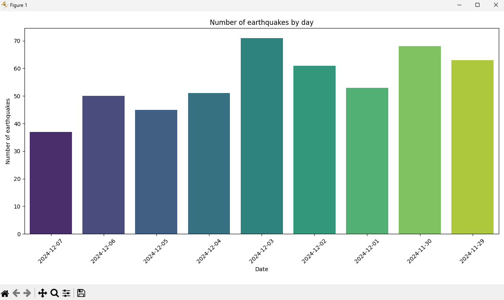

# Earthquake Analysis and Statistics Mapping
(Deprem Analizi ve İstatistiksel Haritalama)

This project focuses on analyzing earthquake data and visualizing seismic activity in Turkey using Python.
(Bu proje, Python kullanılarak Türkiye’deki deprem verilerinin analiz edilmesini ve sismik aktivitelerin görselleştirilmesini amaçlamaktadır.)

The study includes three different data analysis steps and an interactive earthquake map created with real earthquake records.
(Çalışma, gerçek deprem verileri kullanılarak yapılan üç farklı analiz ve etkileşimli bir deprem haritası içermektedir.)

The project was developed to practice data analysis, visualization, and working with real-world datasets.
(Bu proje, veri analizi, görselleştirme ve gerçek dünya veri setleriyle çalışma pratiği kazanmak amacıyla geliştirilmiştir.)

## 📌 Project Description (Proje Açıklaması)

- Performs statistical analysis on earthquake data
  (Deprem verileri üzerinde istatistiksel analizler gerçekleştirir)
- Analyzes earthquake magnitude distribution
  (Deprem büyüklüklerinin dağılımını inceler)
- Examines the relationship between earthquake depth and magnitude
  (Deprem derinliği ile büyüklük arasındaki ilişkiyi analiz eder)
- Visualizes earthquake locations on an interactive map
  (Deprem konumlarını etkileşimli bir harita üzerinde görselleştirir)
- Uses real earthquake records stored in Excel format
  (Excel formatında gerçek deprem kayıtlarını kullanır)

## 📊 Analyses Performed (Yapılan Analizler)

**Earthquake Frequency Analysis**
Number of earthquakes over time
(Zamana göre deprem sayısı analizi)

**Magnitude Distribution Analysis**
Distribution of earthquake magnitudes (ML)
(Deprem büyüklüklerinin (ML) dağılımı)

**Depth vs Magnitude Analysis**
Relationship between earthquake depth and magnitude
(Deprem derinliği ile büyüklük arasındaki ilişki)

🗺️ Earthquake Map (Deprem Haritası)

An interactive map created using Folium

Each earthquake is displayed as a circle marker

Marker size is proportional to earthquake magnitude

Popups show location, magnitude, and depth information

(Folium kullanılarak oluşturulmuş etkileşimli bir harita.
Her deprem büyüklüğüne göre ölçeklenen dairelerle gösterilir ve konum, büyüklük, derinlik bilgileri popup olarak sunulur.)

## 📊 Dataset / Veri Seti

Earthquake Records (Excel)
(Deprem Kayıtları – Excel)

The dataset includes:
- Date and time
- Location
- Magnitude (ML)
- Depth (km)
- Latitude and longitude

(Veri seti tarih, saat, yer, büyüklük (ML), derinlik (km), enlem ve boylam bilgilerini içermektedir.)

## 🧠 Methodology (Yöntem)

- Dataset is loaded from Excel
  (Veri seti Excel dosyasından yüklenir)
- Date and time columns are merged into a single datetime column
  (Tarih ve saat sütunları birleştirilir)
- Missing and invalid magnitude values are removed
  (Eksik ve geçersiz büyüklük değerleri temizlenir)
- Statistical analyses are performed using Pandas and Seaborn
  (Pandas ve Seaborn ile istatistiksel analizler yapılır)
- Earthquake locations are visualized using Folium
  (Folium ile deprem konumları harita üzerinde gösterilir)

## 🛠️ Technologies / Kullanılan Teknolojiler

- Python
- Pandas
- Matplotlib
- Seaborn
- Folium

## 📌 Project Note (Proje Notu)

This project was developed by following a data analysis course
and further modified and extended for learning and practice purposes.
The implementation and analysis were customized by the author
to better understand earthquake data analysis and visualization.

(Bu proje bir veri analizi kursu kapsamında geliştirilmiş,
öğrenme ve pratik amacıyla tarafımdan düzenlenmiş, genişletilmiş
ve analiz edilmiştir.)

## ⚠️ Disclaimer (Uyarı)

This project is for educational and analytical purposes only
and should not be used for seismic risk assessment or official decision-making.

(Bu proje yalnızca eğitim ve analiz amaçlıdır
ve resmi deprem risk değerlendirmeleri için kullanılmamalıdır.)

## 🌍 Earthquake Map Visualization

You can find them in the screenshots section, for example:



## ▶️ Usage / Kullanım

Install required libraries (Gerekli kütüphaneleri yükleyin):
```bash
pip install -r requirements.txt
