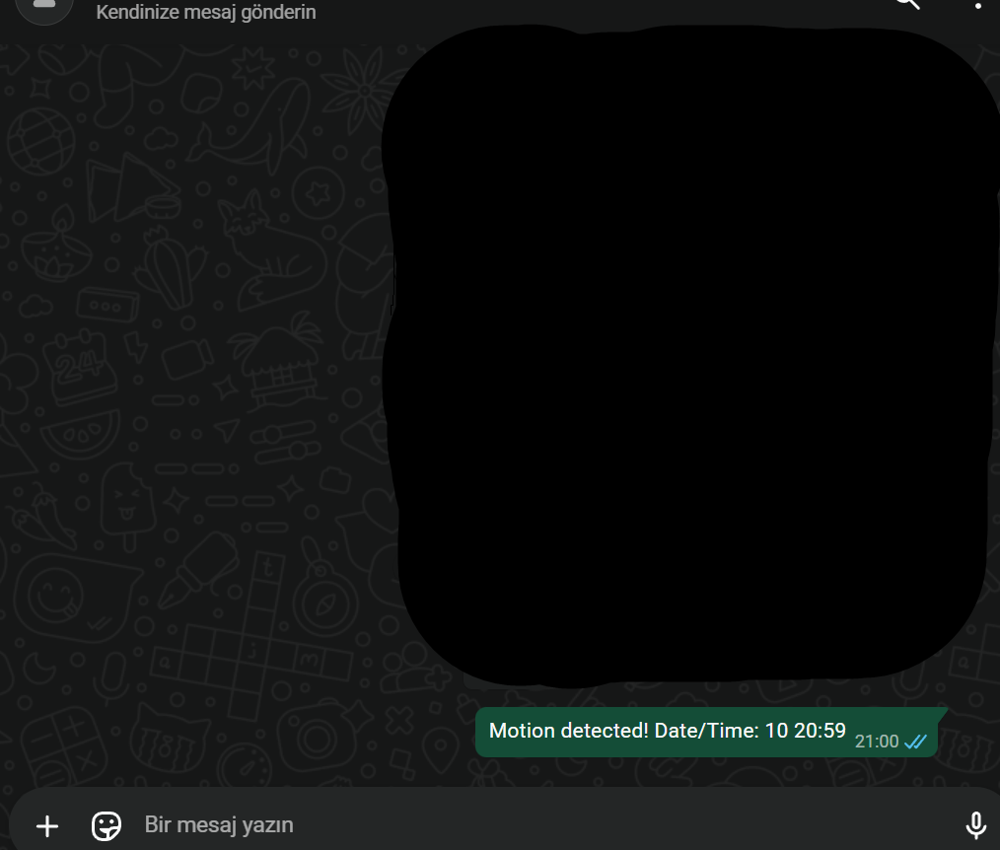

# Motion Detection WhatsApp Alert System
(Hareket Algılama ve WhatsApp Bildirim Sistemi)

This project focuses on detecting motion using a webcam and sending an automatic WhatsApp message when movement is detected.
(Bu proje, webcam kullanarak hareket algılamayı ve hareket tespit edildiğinde otomatik olarak WhatsApp mesajı göndermeyi amaçlamaktadır.)

The system is built with Python and OpenCV and uses WhatsApp Web for message delivery.
(Sistem Python ve OpenCV ile geliştirilmiştir ve mesaj gönderimi için WhatsApp Web kullanılmaktadır.)

## 📌 Project Description (Proje Açıklaması)

- Captures live video from the webcam
  (Webcam üzerinden canlı görüntü alır)
- Detects motion using background subtraction (MOG2)
  (Arka plan çıkarımı (MOG2) yöntemiyle hareket algılar)
- Filters small movements to reduce false detections
  (Yanlış alarmları azaltmak için küçük hareketleri filtreler)
- Sends an automated WhatsApp alert when motion is detected
  (Hareket algılandığında otomatik WhatsApp bildirimi gönderir)
- Uses a cooldown mechanism to prevent message spam
  (Mesaj spamini önlemek için bekleme süresi kullanır)
- Displays live camera feed and motion status on screen
  (Canlı kamera görüntüsünü ve hareket durumunu ekranda gösterir)

## 🧠 How It Works (Nasıl Çalışır)

The webcam feed is continuously processed frame by frame.
(Webcam görüntüsü kare kare işlenir.)

A background model is created and updated over time to distinguish moving objects from the static background.
(Hareketli nesneleri sabit arka plandan ayırmak için zamanla güncellenen bir arka plan modeli oluşturulur.)

When a significant motion area is detected, a WhatsApp message containing the date and time is sent.
(Belirli bir eşik üzerinde hareket algılandığında tarih ve saat bilgisi içeren bir WhatsApp mesajı gönderilir.)

## 🧪 Motion Detection Logic (Hareket Algılama Mantığı)

- Background subtraction with MOG2 algorithm
  (MOG2 algoritması ile arka plan çıkarımı)
- Binary thresholding and morphological operations
  (İkili eşikleme ve morfolojik işlemler)
- Contour detection and area filtering
  (Kontür tespiti ve alan bazlı filtreleme)

## 📱 WhatsApp Alert System (WhatsApp Bildirim Sistemi)

- Messages are sent using WhatsApp Web
  (Mesajlar WhatsApp Web üzerinden gönderilir)
- Keyboard automation is handled with PyAutoGUI
  (Klavye otomasyonu PyAutoGUI ile sağlanır)
- The system can also send messages to the user's own number
  (Sistem kullanıcının kendi numarasına da mesaj gönderebilir)

## 🛠️ Technologies / Kullanılan Teknolojiler

Python  
OpenCV  
PyAutoGUI  
WhatsApp Web  

## 📌 Project Note (Proje Notu)

This project was created by following an online computer vision course.
The code structure, comments, and behavior were adjusted and improved
to better understand motion detection and basic automation workflows.

(Bu proje bir kursu takip edilerek oluşturulmuştur.
Kod yapısı, yorumlar ve davranışlar; hareket algılama ve temel otomasyon
mantığını daha iyi anlamak amacıyla düzenlenmiş ve geliştirilmiştir.)

## ⚠️ Disclaimer (Uyarı)

This project is intended for educational purposes only.
It is not designed to be a professional security or surveillance system.

(Bu proje yalnızca eğitim amaçlıdır.
Profesyonel bir güvenlik veya gözetim sistemi olarak kullanılmak üzere tasarlanmamıştır.)

## 🖼️ Screenshots (Ekran Görüntüleri)



## ▶️ Usage / Kullanım

Install required libraries (Gerekli kütüphaneleri yükleyin):

```bash
pip install -r requirements.txt
